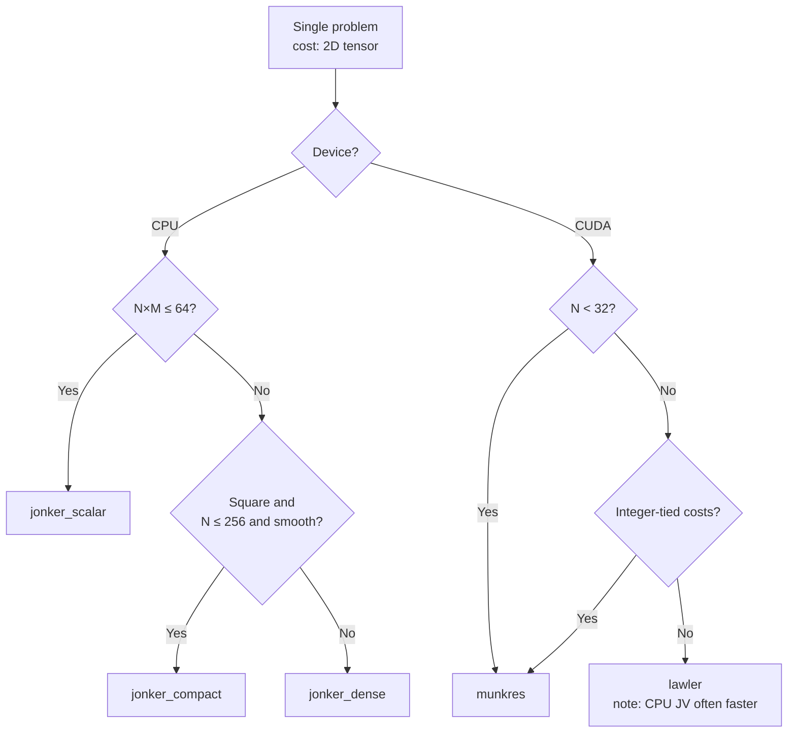
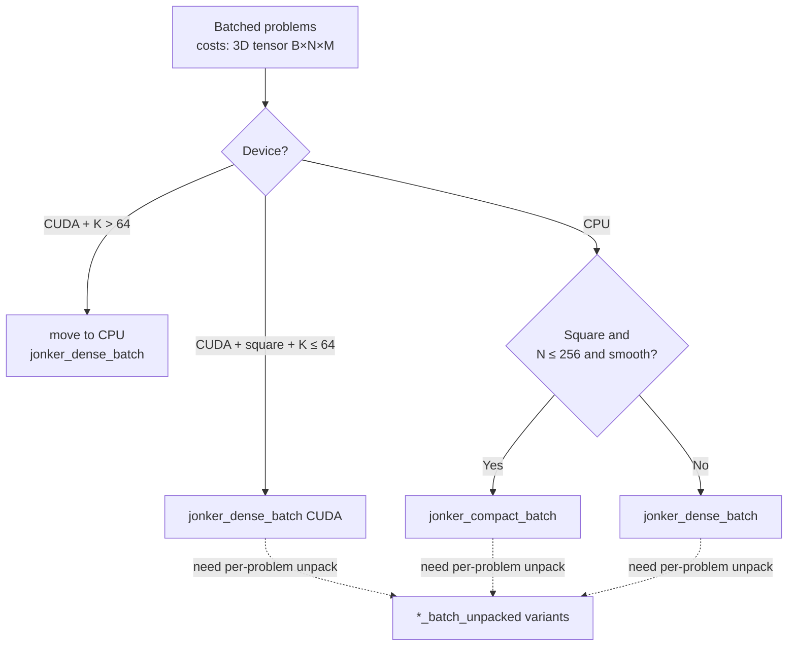

`torchmatch.assignment.solve` automates the choice between the ops below using
the same rules this page describes. Read this guide when you want to
override the automatic backend selection (`AUTO`), when you need to understand
which op `solve` is selecting, or when you are benchmarking. The indented
blockquotes below each rule show what `solve` picks at that branch.

## Single-problem decision tree

### Rules of thumb

- **CPU default**: `jonker_dense`. Holds up across distributions,
  fastest at N ≥ 256.

  > `solve(cost)` picks `jonker_dense` for rectangular CPU inputs above
  > the scalar threshold.

- **CPU small smooth**: `jonker_compact` for square `N ≤ 256` with
  `uniform` / `gamma` costs (smooth here means continuously distributed,
  as opposed to integer-valued or highly tied; 20 to 30 % faster than
  dense). Falls behind `dense` on `iou` and `gated_sparse`.

  > `solve(cost)` picks `jonker_compact` for square CPU inputs above the
  > scalar threshold.

- **Portable, no vector instructions**: `jonker_scalar`. Useful when
  deploying to CPUs without AVX2 SIMD support. Within 2× of the
  AVX2-optimized variants on `iou` costs; 2 to 4× slower on dense
  uniform costs.

  > `solve(cost)` picks `jonker_scalar` when `N*M ≤ 64`.

- **CUDA, any N, integer-tied costs**: `munkres` (Munkres' single-path
  implementation). The only case where a CUDA-based solver beats the
  CPU Jonker-Volgenant solvers, sometimes by 2× at N = 1024.

  > `solve(cost)` picks `munkres` for 2D CUDA inputs with `N < 32`.

- **CUDA, N ≥ 512, dense costs**: `lawler`. Faster than `munkres` for
  large, fully-populated cost matrices because its parallel search
  strategy finds augmenting paths more efficiently at scale.

  > `solve(cost)` picks `lawler` for 2D CUDA inputs with `N ≥ 32`.

- **CUDA, N ≤ 256, dense costs**: `munkres` leads on CUDA, but CPU JV
  runs **10 to 100× faster** at these sizes. Use CUDA only when the
  data already sits on the device and the H2D round-trip dominates.

## Batched decision tree

### Rules of thumb

- **Tracking after gating** (B ≤ 64 frames, N ≤ 64 boxes, IoU / gated
  costs): `jonker_dense_batch` on CUDA wins. About 1.3 to 2 ms per call
  at typical sizes.

  > `solve(costs)` picks the CUDA backend for square 3D CUDA inputs with
  > `K ≤ 64`.

- **Many small problems in a batch**: CPU `jonker_dense_batch` scales
  linearly with the batch size B because problems run in parallel CPU
  threads. The CUDA tiled variant scales sublinearly for small N because
  the GPU is already saturated handling each problem; adding more
  problems to the batch gives diminishing returns.

  > `solve(costs)` picks `jonker_dense_batch` for rectangular 3D CPU
  > inputs.

  > `solve(costs)` picks `jonker_compact_batch` for square 3D CPU inputs.

- **Per-problem unpack**: when the alternative iterates B problems in
  Python to extract `(matches, unmatched_rows, unmatched_cols)`, the
  `_unpacked` variants cost about 5 % more in-kernel and eliminate the
  Python loop entirely.

## Picking by distribution

| Your costs look like      | Best CPU                                         | Best CUDA                                                                   |
| ------------------------- | ------------------------------------------------ | --------------------------------------------------------------------------- |
| `U(0, 1)` random          | `jonker_compact` (small N), `jonker_dense` (large N)     | `munkres` (small N), `lawler` (large N), but CPU is faster        |
| Gamma / long-tail score   | same as uniform                                  | same as uniform                                                             |
| `1 - IoU` (object-detection overlap cost, common in tracking) | `jonker_dense` (slightly faster than compact on iou) | `lawler` when forced to CUDA, but CPU runs 10× faster          |
| Mostly +inf (cost matrix is sparse: many entries are set to +inf to mark forbidden or implausible pairings) | `jonker_dense` (compact slows down 2× here) | `munkres`                                                        |
| Small integer support (costs drawn from a small set of integer values, causing many ties) | `jonker_dense` (3× faster than uniform)              | `munkres` (**100× faster than uniform**, finally beats CPU)       |

## Picking by tracing requirements

| Requirement                                           | OK to use                                                                                         |
| ----------------------------------------------------- | ------------------------------------------------------------------------------------------------- |
| Eager mode (no compile)                               | All ops                                                                                           |
| `torch.compile(default)`                              | All ops (every op registers a shape-inference kernel required by the compiler)                    |
| `torch.compile(mode="reduce-overhead")` (CUDA graphs) | `jonker_dense_batch` CUDA backend only. `munkres`, `hybrid`, and `lawler` are tagged `cudagraph_unsafe` — they synchronize with the CPU during execution and cannot be captured into a CUDA graph, so they will raise an error under `reduce-overhead` mode. |
| `torch.export`                                        | All ops                                                                                           |

## See also

- [Benchmarks](/resources/benchmarks): interactive per-op latency across
  contributor hardware.
- [Contributing benchmarks](/resources/benchmarks/contributing): how to run the
  suite on your own machine.
