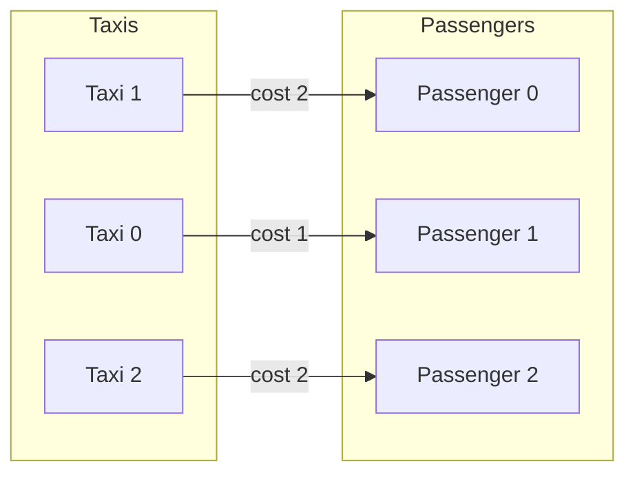

## A concrete starting point: taxi dispatch

Suppose a dispatch center has three taxis and three passengers waiting at different locations. The dispatcher must send each taxi to exactly one passenger, and wants to minimize total travel time. That constraint — one taxi per passenger, one passenger per taxi — is what makes this an **assignment problem**.

The inputs are summarized in a cost matrix. Each row is a taxi, each column is a passenger, and the value at position `[i, j]` is the cost (say, travel time in minutes) of sending taxi `i` to passenger `j`:

```python
import torch

#         passenger 0  passenger 1  passenger 2
cost = torch.tensor([
    [4.0,            1.0,          3.0],   # taxi 0
    [2.0,            0.0,          5.0],   # taxi 1
    [3.0,            2.0,          2.0],   # taxi 2
])
```

An **assignment** is a selection of one entry per row, with no two rows sharing a column. It represents a valid dispatch plan: each taxi goes to exactly one passenger, each passenger is served by exactly one taxi.

Reading the matrix by eye, taxi 1 is closest to passenger 1 (cost 0), taxi 0 is next-closest to passenger 1 (cost 1) but passenger 1 is already taken, so taxi 0 goes to passenger 1... this kind of manual reasoning breaks down quickly. The formal goal is to find the permutation that minimizes total cost.

## What "valid" means

A valid assignment satisfies two conditions:

1. Each row maps to exactly one column (each taxi is dispatched once).
2. No two rows map to the same column (each passenger is served once).



The optimal assignment above has total cost 1 + 2 + 2 = 5.

## Why brute force fails

The number of valid assignments for an `n × n` problem is `n!`: there are `n` choices for row 0, `n-1` remaining for row 1, and so on. This grows fast:

| n  | Assignments (n!) |
|----|-----------------|
| 5  | 120 |
| 10 | 3,628,800 |
| 15 | 1.3 × 10^12 |
| 20 | 2.4 × 10^18 |

At n = 20, exhaustive search is computationally infeasible on any hardware. Even modest tracking problems (50 detections per frame, 25 FPS) would require evaluating 50! assignments per frame, which is not a meaningful number.

The linear assignment problem (LAP) is solved optimally in `O(n^3)` by polynomial-time algorithms — dramatically better than the factorial growth of brute force.

## Solving with torchmatch

`torchmatch.assignment.solve` handles the dispatch automatically. For the taxi example:

```python
import torchmatch

row_to_col = torchmatch.assignment.solve(cost)
print(row_to_col.tolist())
# [1, 0, 2]

# row 0 -> col 1 (taxi 0 -> passenger 1, cost 1.0)
# row 1 -> col 0 (taxi 1 -> passenger 0, cost 2.0)
# row 2 -> col 2 (taxi 2 -> passenger 2, cost 2.0)

total = cost[torch.arange(3), row_to_col].sum().item()
print(total)
# 5.0
```

The output is a 1-D `int64` tensor of length `n`. Entry `i` holds the column assigned to row `i`. The total cost is 5.0, which is optimal.

## Rectangular problems and unmatched rows

Real dispatch scenarios are rarely square. If there are more taxis than passengers, some taxis stay idle. Pass a tall matrix (`n_rows > n_cols`):

```python
# 4 taxis, 3 passengers: one taxi will be unmatched
cost_rect = torch.tensor([
    [4.0, 1.0, 3.0],
    [2.0, 0.0, 5.0],
    [3.0, 2.0, 2.0],
    [6.0, 5.0, 1.0],
])
row_to_col = torchmatch.assignment.solve(cost_rect)
print(row_to_col.tolist())
# e.g. [1, 0, 2, -1]  (taxi 3 is unmatched)
```

Unmatched rows return `-1`. When there are more columns than rows, all rows match and some columns are simply never used.

## Forbidden edges with +inf

Sometimes a pairing is physically impossible (a taxi is on the wrong side of a highway, a detection is outside a camera's field of view). Mark those entries as `+inf`:

```python
cost_gated = torch.tensor([
    [4.0, 1.0, float("inf")],
    [2.0, float("inf"), 5.0],
    [float("inf"), 2.0, 2.0],
])
row_to_col = torchmatch.assignment.solve(cost_gated)
print(row_to_col.tolist())
# [1, 0, 2]  (infeasible pairs are avoided)
```

The solver replaces `+inf` internally with a large finite sentinel before running, so no pre-processing is needed. If forbidden edges make a complete assignment impossible, the affected rows return `-1`. Note that `NaN` is not a forbidden-edge encoding: torchmatch raises a `RuntimeError` when it encounters `NaN`, because NaN in a cost matrix signals a bug upstream (such as a division-by-zero in a distance computation), not an intentional constraint.

## The connection to the Hungarian algorithm

The algorithms powering this call trace back to work by Kuhn (1955) and Munkres (1957), which formalized a class of primal-dual methods for the assignment problem. Those ideas are refined in the Jonker-Volgenant successive shortest-path procedure that `solve` uses by default on CPU: it builds dual variables (prices on rows and columns) that guide a Dijkstra-style search toward the optimal matching in `O(n^3)` time. The [Algorithms](/algorithms/assignment/algorithms) page explains the three implementations in detail.

## See also

- [Quickstart](/algorithms/assignment/quickstart): CPU and CUDA variants, forbidden edges, batched inputs, all in one page.
- [Algorithms](/algorithms/assignment/algorithms): the Hungarian method and the three torchmatch implementations.
