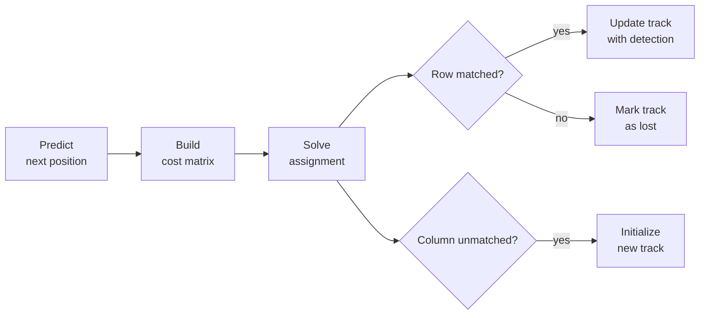

## The multi-object tracking problem

A multi-object tracker receives a stream of detections from a detector (bounding boxes output by something like YOLO or DETR) and must maintain identity-consistent tracks across frames. At each frame, it answers the question: which detection corresponds to which existing track?

This is an assignment problem. Rows are the existing tracks (objects being followed), columns are the new detections, and the cost at `[i, j]` measures how dissimilar track `i` and detection `j` appear. The solver finds the minimum-cost one-to-one matching.

## Intersection over union

The standard similarity measure for axis-aligned bounding boxes is **intersection over union** (IoU). Given two boxes, compute the area of their overlap and divide by the area of their union:

```
IoU(A, B) = area(A ∩ B) / area(A ∪ B)
```

IoU is 1 when the boxes coincide exactly, and 0 when they do not overlap at all. It is scale-invariant: a small box and a large box with identical overlap fraction produce the same IoU as two large boxes with the same fraction.

For the cost matrix, flip the sign: `C[i, j] = 1 - IoU(track_i, det_j)`. A cost of 0 means a perfect match; a cost close to 1 means the boxes barely overlap.

```python
import torch

def box_iou(boxes_a: torch.Tensor, boxes_b: torch.Tensor) -> torch.Tensor:
    """
    Compute pairwise IoU between two sets of boxes.

    Args:
        boxes_a: (N, 4) in x1, y1, x2, y2 format
        boxes_b: (M, 4) in x1, y1, x2, y2 format

    Returns:
        (N, M) IoU matrix
    """
    lo = torch.maximum(boxes_a[:, None, :2], boxes_b[None, :, :2])
    hi = torch.minimum(boxes_a[:, None, 2:], boxes_b[None, :, 2:])
    inter = (hi - lo).clamp_min(0).prod(-1)
    area_a = (boxes_a[:, 2:] - boxes_a[:, :2]).prod(-1)[:, None]
    area_b = (boxes_b[:, 2:] - boxes_b[:, :2]).prod(-1)[None, :]
    return inter / (area_a + area_b - inter + 1e-9)
```

## Gating: ruling out implausible pairs

Before solving, it is good practice to forbid pairs that are geometrically implausible. A track whose predicted box is in the top-left corner of the frame should not be matched to a detection in the bottom-right, even if it happens to have the lowest cost.

Set the cost for any pair whose centroid distance exceeds a threshold to `+inf`:

```python
def iou_cost_gated(pred_boxes: torch.Tensor,
                   det_boxes: torch.Tensor,
                   gate: float = 0.5) -> torch.Tensor:
    """(1 - IoU) cost matrix with centroid-distance gating."""
    cost = 1.0 - box_iou(pred_boxes, det_boxes)
    centers_pred = (pred_boxes[:, None, :2] + pred_boxes[:, None, 2:]) / 2
    centers_det  = (det_boxes[None, :, :2]  + det_boxes[None, :, 2:])  / 2
    dist = (centers_pred - centers_det).norm(dim=-1)
    cost = cost.masked_fill(dist > gate, float("inf"))
    return cost
```

The solver treats `+inf` as a forbidden edge. Rows where every entry is `+inf` (because every detection is too far away) will be returned as unmatched with index `-1`.

## The tracking loop

A minimal SORT-style tracker maintains a list of active tracks. Each track holds a predicted bounding box (updated by a Kalman filter or, for simplicity here, just carried forward) and a unique integer ID. At each frame:

1. Predict updated box positions for all existing tracks.
2. Build the cost matrix between predicted track boxes and incoming detections.
3. Solve the assignment problem.
4. For matched pairs: update the track with the new detection. For unmatched tracks: mark as lost. For unmatched detections: start a new track.



Here is a complete, runnable implementation:

```python
import torch
import torchmatch
from dataclasses import dataclass, field
from typing import Optional

@dataclass
class Track:
    track_id: int
    box: torch.Tensor        # (4,) in x1, y1, x2, y2
    lost_frames: int = 0

class SimpleTracker:
    def __init__(self, iou_threshold: float = 0.3, max_lost: int = 3):
        self.iou_threshold = iou_threshold
        self.max_lost = max_lost
        self.tracks: list[Track] = []
        self._next_id = 0

    def _new_id(self) -> int:
        i = self._next_id
        self._next_id += 1
        return i

    def update(self, detections: torch.Tensor) -> list[Track]:
        """
        Args:
            detections: (D, 4) bounding boxes for the current frame,
                        in x1, y1, x2, y2 format.

        Returns:
            Active tracks after this update.
        """
        if not self.tracks:
            # No existing tracks: every detection starts a new track.
            for box in detections:
                self.tracks.append(Track(self._new_id(), box.clone()))
            return self.tracks

        pred_boxes = torch.stack([t.box for t in self.tracks])   # (T, 4)

        if detections.numel() == 0:
            # No detections this frame: all tracks become lost.
            for t in self.tracks:
                t.lost_frames += 1
            self.tracks = [t for t in self.tracks if t.lost_frames <= self.max_lost]
            return self.tracks

        # Build the gated IoU cost matrix.
        cost = iou_cost_gated(pred_boxes, detections,
                              gate=self.iou_threshold * 2)
        # Forbid assignments with low IoU (high cost) outright.
        cost = cost.masked_fill(cost > (1.0 - self.iou_threshold), float("inf"))

        # Solve: row_to_col[i] is the detection assigned to track i, or -1.
        row_to_col = torchmatch.assignment.solve(cost)

        matched_det_indices = set()
        for i, t in enumerate(self.tracks):
            j = int(row_to_col[i].item())
            if j >= 0:
                # Matched: update the track with the new detection box.
                t.box = detections[j].clone()
                t.lost_frames = 0
                matched_det_indices.add(j)
            else:
                # Unmatched track: increment lost counter.
                t.lost_frames += 1

        # Remove tracks that have been lost for too long.
        self.tracks = [t for t in self.tracks if t.lost_frames <= self.max_lost]

        # Unmatched detections: start a new track for each.
        for j in range(len(detections)):
            if j not in matched_det_indices:
                self.tracks.append(Track(self._new_id(), detections[j].clone()))

        return self.tracks
```

## Reading the output

After each call to `update`, the return value is the list of active tracks. Each track carries its integer ID (stable across frames while matched) and its current bounding box. A track absent from the active list has been dropped (lost for more than `max_lost` consecutive frames).

To see matched pairs, unmatched tracks (lost), and unmatched detections (new objects) explicitly:

```python
# After the solve step:
matched_tracks  = [t for i, t in enumerate(tracker.tracks)
                   if int(row_to_col[i].item()) >= 0]
lost_tracks     = [t for i, t in enumerate(tracker.tracks)
                   if int(row_to_col[i].item()) < 0]
new_detections  = [j for j in range(len(detections))
                   if j not in matched_det_indices]
```

## Batching all frames for performance

The loop above calls `solve` once per frame. When processing a batch of frames offline (for evaluation or training), it is faster to build a batched cost tensor of shape `(B, T, D)` and call `solve` once:

```python
# costs: (B, T, D) where B=frames, T=tracks, D=detections per frame
batch_assignments = torchmatch.assignment.solve(costs)   # (B, T)

# Recover matched/unmatched per frame using the unpacked variant:
matches, unmatched_tracks, unmatched_dets, n_matched = torchmatch.assignment.solve(
    costs, unpack=True,
)
# matches[b, :n_matched[b]] are the matched (track, detection) pairs for frame b.
```

The batched path distributes frames across CPU threads via `parallel_for`. For square problems with `T == D <= 64`, the CUDA backend is also available and can be graph-captured for minimal kernel-launch overhead. See [Backends and batching](/algorithms/assignment/tutorials/backends) for the dispatch rules.

## Going further

The tracker above uses a constant velocity model (no motion prediction). Real-world systems like SORT @Bewley2016 wrap each track in a Kalman filter that predicts the next-frame box before building the cost matrix. ByteTrack @Zhang2022 and BoT-SORT @Aharon2022 extend this with appearance embeddings and camera-motion compensation, but the assignment step at the core remains the same: build a cost matrix, call a LAP solver, unpack matched and unmatched sets.

## See also

- [Reference](/algorithms/assignment/reference): exact op signatures and output shapes.
- [Benchmarks](/resources/benchmarks): latency numbers for batched IoU cost problems across hardware.

::Bibliography
::
