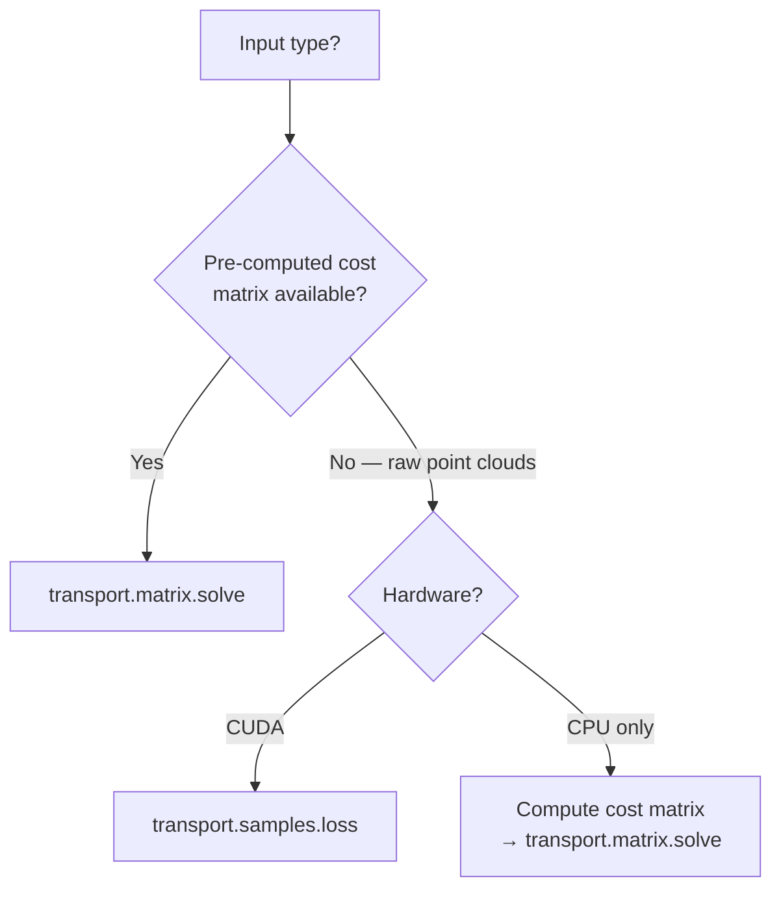
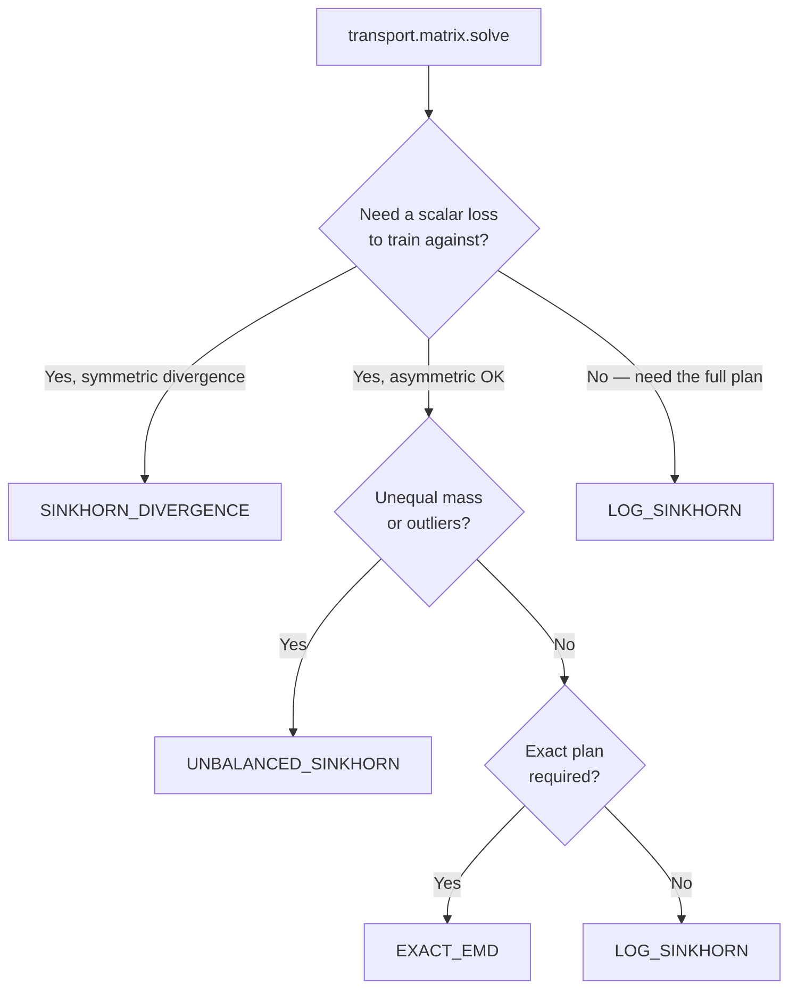

`torchmatch.transport.matrix.solve` resolves `Backend.AUTO` to `LOG_SINKHORN` in all cases.
Read this page to understand or override that choice, or when deciding between the matrix and samples entry points (called faces in this library).

## Matrix vs samples face

The first decision is which entry point to use:



Use `transport.samples.loss` when:
- Both point clouds are already on CUDA.
- The cost is squared Euclidean `|x - y|^2` (currently the only cost supported).
- You want to avoid allocating an `N × M` cost matrix.

Use `transport.matrix.solve` when:
- Your cost function is not squared Euclidean (e.g. cosine, L1, KL divergence).
- You need CPU support.
- You have already computed or cached the cost matrix.
- You need the full transport plan — a matrix P where each entry P[i,j] describes how much mass is moved from source point i to target point j (not just a single summary scalar).

## Backend decision tree (matrix face)



## Rules of thumb

### `LOG_SINKHORN` — the default

- Differentiable, CPU + CUDA.
- Returns the transport plan in log-space (i.e. log P); call `.exp()` to recover P, an N × M matrix whose entries describe how much mass each source point sends to each target point.
- Use when you need the plan itself (e.g. to compute expected cost, to derive soft
  attention, or as a soft assignment for downstream tasks).
- The raw inner-product loss does not reach zero even when the two distributions are identical (because the entropic regularisation adds a fixed bias). When the loss value matters for comparisons, prefer `SINKHORN_DIVERGENCE`.
- Tune `reg` (default 0.1) and `n_iter` (default 100). Smaller `reg` → sharper plan,
  more iterations needed.

### `SINKHORN_DIVERGENCE` — symmetric training loss

- Runs the Sinkhorn algorithm three times — once between your two distributions and once for each distribution against itself — then subtracts the self-transport terms to cancel the bias introduced by regularisation, giving a true zero when the two distributions match.
- Returns a scalar ≥ 0 (or `(B,)` tensor); equals 0 when the source and target
  distributions are identical.
- The recommended choice for **generative-model training** where the loss must be
  interpretable and symmetric.
- About 3× slower than `LOG_SINKHORN`; the main cost at large N is computing the two extra N × N distance matrices (one for each distribution against itself).

### `UNBALANCED_SINKHORN` — partial matching and outliers

- Instead of requiring every source point to send exactly its prescribed mass and every target to receive exactly its prescribed amount (the balanced constraint), this backend allows each point to send or receive less than required — penalising the shortfall with a KL-divergence penalty controlled by `rho`. Each point can therefore "leak" mass rather than being forced to pair with a distant counterpart.
- Returns the transport plan in log-space; the total mass assigned to each source point and each target point will be close to, but not exactly, the prescribed weights `a` (source) and `b` (target).
- Use when the source and target have **different total mass**, or when **outlier points**
  should not distort the coupling.
- Control via `rho` (API default 1.0) or `reach` / `reach_x` / `reach_y` in `samples.loss`:
  - `reach → ∞`: recovers balanced OT, enforcing marginal constraints (the requirement that the total mass sent from each source sums to a_i, and the total mass received at each target sums to b_j).
  - `reach = 0.1`: heavy relaxation; outliers are nearly ignored. At reach=0.1, the solver is quite permissive: source points that cannot be cheaply matched simply contribute less mass to the coupling rather than being forced to pair with a distant target.

### `EXACT_EMD` — exact plan, small problems

- Uses the network simplex algorithm (a classic exact combinatorial solver) — no regularisation, fully deterministic.
- Returns the exact coupling; plan is sparse (at most `N + M − 1` non-zero entries).
- **Not differentiable**: the plan is a step function with discontinuous argmax.
- **CPU only**.
- Use for ground-truth comparisons, benchmarks, or small problems where numerical exactness
  is required. At `N = M = 256` expect about 50–200 ms per problem.

## Picking `reg` (matrix face) and `blur` (samples face)

| Goal | `reg` / `blur` |
|---|---|
| Soft, smooth plan (attention-like) | high (0.5 – 2.0) |
| Moderate smoothing | medium (0.05 – 0.5) |
| Approximately sharp plan | low (0.005 – 0.05) |
| Very sharp (near exact) | very low + `scaling=0.5` + many iterations |

Smaller `reg` converges more slowly. Use `scaling` to start the solver at a coarse regularisation level and gradually tighten it, which reaches convergence faster when `reg` is very small:

```python
log_plan = torchmatch.transport.matrix.solve(
    cost, reg=0.01, n_iter=500, scaling=0.5,
)
```

## Comparing by use case

| Use case | Recommended |
|---|---|
| Generative shape loss (training) | `samples.loss(x, y, debias=True)` |
| Generative shape loss (fast, no bias correction needed) | `samples.loss(x, y)` |
| Soft differentiable matching (plan needed) | `matrix.solve(C, backend=LOG_SINKHORN)` |
| Symmetric distance for evaluation | `matrix.solve(C, backend=SINKHORN_DIVERGENCE)` |
| Domain adaptation (partial overlap) | `matrix.solve(C, backend=UNBALANCED_SINKHORN)` |
| Outlier-robust point-cloud loss | `samples.loss(x, y, reach=0.5)` |
| Reference / ground-truth plan | `matrix.solve(C, backend=EXACT_EMD)` (small N) |
| Needs CPU | `matrix.solve(C)` — any backend except `EXACT_EMD` for large N |

## Tracing requirements

| Requirement | OK to use |
|---|---|
| Eager mode | All backends |
| `torch.compile` | `LOG_SINKHORN`, `SINKHORN_DIVERGENCE`, `UNBALANCED_SINKHORN`, `samples.loss` |
| `torch.compile` with backward | same as above; all register `FakeTensor` and `register_autograd` |
| `torch.export` | `LOG_SINKHORN`, `SINKHORN_DIVERGENCE`, `UNBALANCED_SINKHORN` |
| CUDA graphs | `LOG_SINKHORN`, `SINKHORN_DIVERGENCE`, `UNBALANCED_SINKHORN` (no host syncs) |

`EXACT_EMD` does not trace (network simplex is not differentiable and has data-dependent
control flow).

## See also

- [Algorithms](/algorithms/transport/algorithms): mathematical derivation of each backend.
- [Reference](/algorithms/transport/reference): full signatures and kwargs.
- [Assignment / Choosing](/algorithms/assignment/choosing): the equivalent guide for the LAP solvers.
